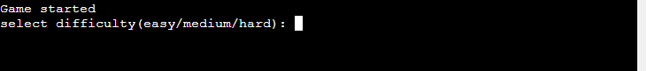
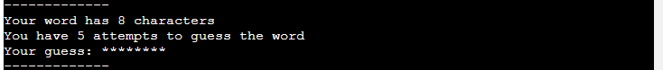
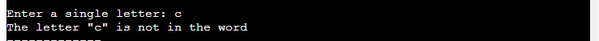
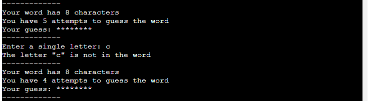
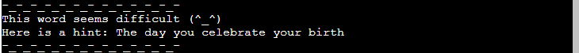

# Guess the word

**Guess the word** is a Python terminal game, which runs in the Code Institute mock terminal on Heroku

Users can try to guess the word within a given number of attempts. 

## How to play

* **Guess the word** is based on a pen and paper childrens game called **Hangman**. You can read more about it on [Wikipedia](https://en.wikipedia.org/wiki/Hangman_(game))
 
* In this version the player enters their name and chooses a difficulty
* A random word is chosen and then it's characters are hidden (replaced by *)
* Based on the difficulty chosen the player is given a set number of attempts to guess the word
* The player wins if all characters from the word have been guessed

## Features

### Existing features
- **Difficulty selection**
  - Players are given three difficulties to select at the start of the game

- **Random word** 
   - A word is chosen randomly based on selected difficulty 
   - Players are given information about the length of the word
   - Players cannot see the word

- **Accepts user input** 
   - Users can enter and guess a letter from the word
   - Users recieve feedback based on their input

- **Tracking of remaining attempts**
  - Users can see if their number of attempts decrease or remain the same

- **Hints**
  - If the user has a small number of remaining attempts a hint is given
  - The hint is meant to help the player guess the word

- **Input validation and error-checking**
  - Users can only select the given difficulties (**easy/medium/hard**)
  - Users can only enter letters when they are guessing

### Future features
  - Allow players to attempt to guess the whole word
  - Give more hints and possibly a riddle
  - Store player highscore in Leaderboard system
    - Player high scores are stored and others can compete against it
  - Players cannot input the same letter 
  - Actively display letters used by players
  - Display hangman ascii to show how close players are to losing the game

# Data Model

For the data set I handpicked words from the english dictionary and categorised them in three "difficulty levels" based on the length of the word.

As an example words under 4 letters are "low difficulty", eight letters are "medium difficulty" and twelve are "hard difficulty".

To eliminate confusion I ensured that the words chosen have the same spelling accross Australian, British and American dictionaries.

# Testing
I have manually tested this project by doing the following:
  - Passed the code through a PEP8 linter and confirmed there are no problems
  - Given invalid inputs: numbers when strings are expected, out of bounds inputs
  - Tested in my local terminal and the Code Institute Heroku terminal

# Bugs 

## Solved bugs
   - fixed a bug where my function `find_index` would not return anything if the letter was not found in the word. As a result the number of guesses left was not decreasing

## Remaining bugs
   - No bugs remaining

## Validator testing

   - **PEP8**
     - No errors were returned from PEP8online.com

# Deployment
This project was deployed using Code Institute's mock terminal for Heroku.
  - Steps for deployment: 
    - Fork or clone this repository
    - Create a new Heroku app
    - Set the buildpacks to `Python` and `NodeJs` in that order
    - Link the Heroku app to the repository
    - Click on **Deploy**

# Credits
  - Code Institute for the deployment terminal
