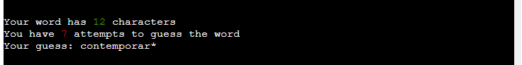

# Guess the word

**Guess the word** is a Python terminal game, which runs in the Code Institute mock terminal on Heroku

Users can try to guess the word within a given number of attempts. 


## How to play

* **Guess the word** is based on a pen and paper childrens game called **Hangman**. You can read more about it on [Wikipedia](https://en.wikipedia.org/wiki/Hangman_(game))
 
* In this version the player enters their name and chooses a difficulty
* A random word is chosen and then it's characters are hidden (replaced by *)
* Based on the difficulty chosen the player is given a set number of attempts to guess the word
* The player wins if all characters from the word have been guessed

## Features

### Existing features
- **Difficulty selection**
  - Players are given three difficulties to select at the start of the game

- **Random word** 
   - A word is chosen randomly based on selected difficulty 
   - Players are given information about the length of the word
   - Players cannot see the word


- **Accepts user input** 
   - Users can enter and guess a letter from the word
   - Users recieve feedback based on their input


- **Tracking of remaining attempts**
  - Users can see if their number of attempts decrease or remain the same


- **Hints**
  - If the user has a small number of remaining attempts a hint is given
  - The hint is meant to help the player guess the word


- **Input validation and error-checking**
  - Users can only select the given difficulties (**easy/medium/hard**)
  - Users can only enter letters when they are guessing


### Future features
  - Allow players to attempt to guess the whole word
  - Give more hints and possibly a riddle
  - Store player highscore in Leaderboard system
    - Player high scores are stored and others can compete against it
  - Display hangman ascii to show how close players are to losing the game

# Data Model

For the data set I handpicked words from the english dictionary and categorised them in three "difficulty levels" based on the length of the word.

As an example words under 4 letters are "low difficulty", eight letters are "medium difficulty" and twelve are "hard difficulty".

To eliminate confusion I ensured that the words chosen have the same spelling accross Australian, British and American dictionaries.

# Testing
I have manually tested this project by doing the following:
  - Passed the code through a PEP8 linter and confirmed there are no problems
  - Given invalid inputs: numbers or special characters when letters are expected, out of bounds inputs
  - Tested in my local terminal and the Code Institute Heroku terminal

# Bugs 

## Solved bugs
   - fixed a bug where my function `find_index` would not return anything if the letter was not found in the word. As a result the number of guesses left was not decreasing

## Remaining bugs
   - In order to give color to text in the terminal I am using ANSI escape codes.
      - The **issue** is in the local terminal that I am executing run.py file. I am using Visual Studio Code and the terminal displays the text incorrectly. Example: ```Your word has ←[32m8←[0m characters```
     - In the mockup terminal deployed on Heroku the colors are rendered and the text for the length of the secret word and the remaining number of guesses are displayed as intended.
     
      


## Validator testing

   - **PEP8**
     - No errors were returned from [PEP8 Python Validator](https://pep8ci.herokuapp.com/)

# Deployment
This project was deployed using Code Institute's mock terminal for Heroku.
  - Steps for deployment: 
    - Fork or clone this repository
    - Create a new Heroku app
    - Set the buildpacks to `Python` and `NodeJs` in that order
    - Link the Heroku app to the repository
    - Click on **Deploy**

The live link can be found here - https://guess-the-word2-76430c36d36e.herokuapp.com/

## Cloning the repository

If you want to have the files into your local machine these are the steps of the process:

**Prerequisites:**

Before you start, ensure that you have Git Bash installed on your computer. You can download it from the official Git website if you haven't already: https://git-scm.com/downloads .

**Step 1: Open Git Bash**

- Open Git Bash by either searching for it in your computer's applications or right-clicking in the directory where you want to clone the repository and selecting "Git Bash Here."
- One other option is to go into your **IDE** in my case it is **Visual Studio Code**
  and click on the **Terminal** button in the top left corner. This will open a terminal section in the bottom.
  - **Make sure that your terminal type is Git Bash otherwise select it from the list**.

**Step 2: Navigate to the Directory**

- Use the `cd` command to navigate to the directory where you want to clone the repository. You can use the `ls` command to list the contents of the current directory and ensure you're in the right place.

```
   cd /path/to/your/directory
```

**Step 3: Clone the Repository**

- Use the `git clone` command followed by the URL of this Git repository.

```
git clone https://github.com/Claudiu-Ionel/Guess-The-Word.git
```

**Step 4: Authentication (if required)**

- If the repository is private or requires authentication, Git Bash will prompt you to enter your username and password or access token. Enter the necessary credentials to continue.

**Step 5: Repository Cloning**

- Git Bash will now begin cloning the repository. You will see a progress indicator as it downloads the files and history from the remote repository to your local machine.

**Step 7: Change Directory to the Cloned Repository**

- To work with the cloned repository, change your working directory to the newly created directory (the same name as the repository).

```
  cd repo  # Replace "repo" with the actual repository name
```

Alternatively you can [Fork](https://docs.github.com/en/get-started/quickstart/fork-a-repo) this repository ([Guess-The-Word](https://github.com/Claudiu-Ionel/Guess-The-Word)) into your github account.

# Credits
  - Code Institute for the deployment terminal
